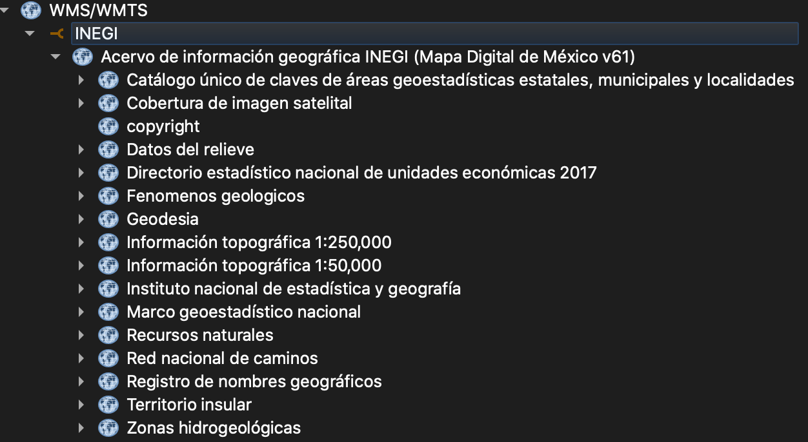
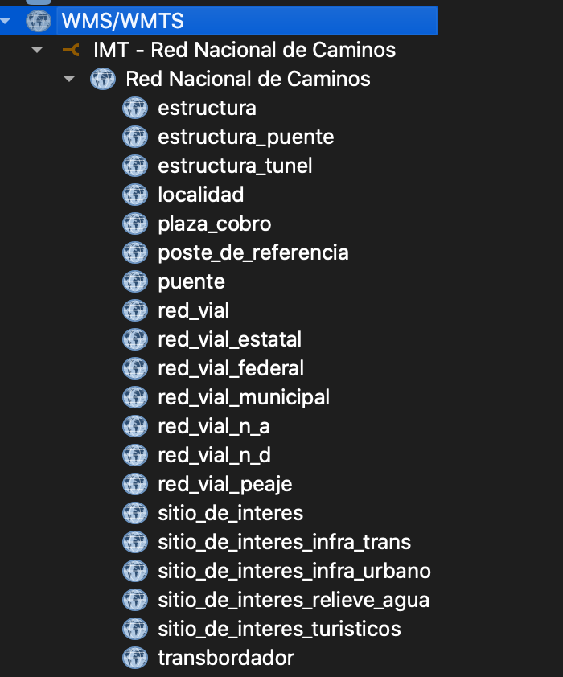

# Geo-Servicios
Geo Servicios wms, wfs, tilexyz, rest, api disponibles en México

## INEGI
Acervo de información Geográfica INEGI (Mapa Digital de México v6.1)
WMS - http://gaia.inegi.org.mx/NLB/tunnel/wms/wms61?

Contenido:

## IMT
Red Nacional de Caminos
WMS - http://189.254.204.50:83/geoserver/RNC2019/wms
Web - 189.254.204.50:83

Contenido:

